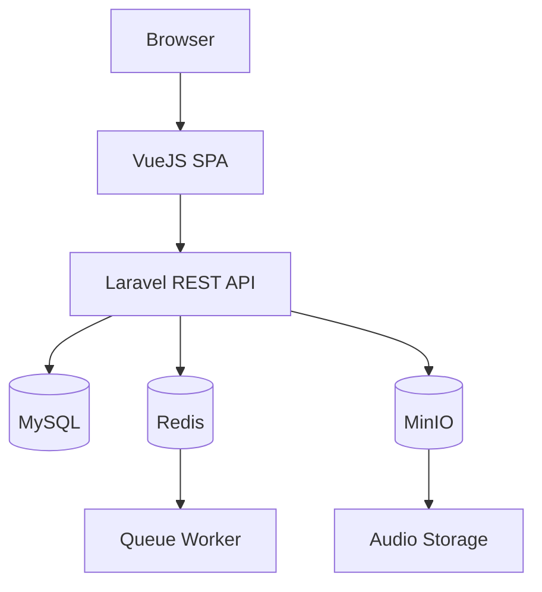
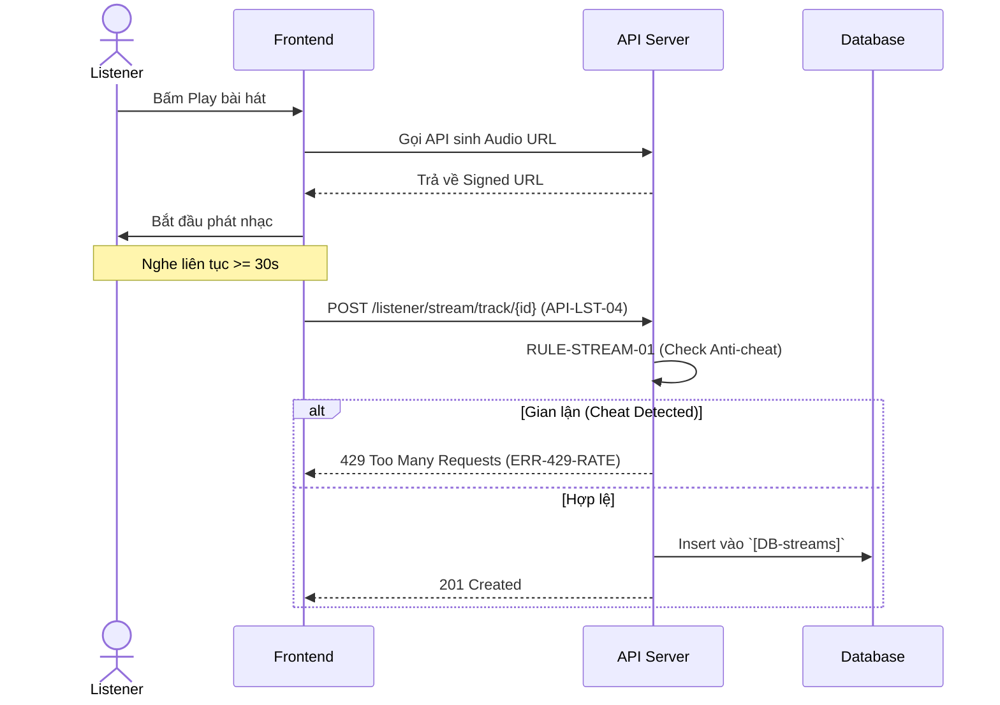

# KIẾN TRÚC HỆ THỐNG & CHIẾN LƯỢC LƯU TRỮ (SYSTEM ARCHITECTURE)

**Dự án:** Nền tảng Âm nhạc Trực tuyến (Audio Streaming Web App)  
**Phiên bản:** 1.0

---

# 1. Introduction

Tài liệu này mô tả kiến trúc tổng thể của hệ thống, cách các thành phần tương tác với nhau, chiến lược lưu trữ dữ liệu và file, cơ chế xử lý nền, cache và triển khai.

Mục tiêu:

- Chuẩn hóa kiến trúc hệ thống
- Dễ dàng mở rộng
- Dễ bảo trì
- Đảm bảo hiệu năng và khả năng mở rộng

---

# 2. Technology Stack

| Layer | Technology |
|---------|------------|
| Frontend | Vue 3 |
| Backend | Laravel 13 |
| API | RESTful API |
| Database | MySQL 8 |
| Cache | Redis |
| Queue | Laravel Queue + Redis |
| Storage | MinIO / Local Storage |
| Authentication | Laravel Sanctum |
| Mail | SMTP |
| Web Server | Nginx |
| Runtime | PHP-FPM |

---

# 3. High-Level Architecture

```text
                    Browser
                       │
                       ▼
                  VueJS SPA
                       │
            REST API (HTTPS)
                       │
                       ▼
                Laravel Backend
        ┌──────────┼──────────┐
        ▼          ▼          ▼
     MySQL      Redis      MinIO
(Database)   (Cache/Queue) (Storage)
```

---

# 4. System Components

## 4.1 Frontend

Chịu trách nhiệm:

- Authentication
- UI Rendering
- Audio Player
- Playlist
- Artist Dashboard
- Admin Dashboard

Frontend chỉ giao tiếp thông qua REST API.

---

## 4.2 Backend

Laravel chịu trách nhiệm:

- Business Logic
- Authentication
- Authorization
- Validation
- File Upload
- Queue Dispatch
- Notification
- Analytics

---

## 4.3 Database

MySQL lưu trữ:

- User
- Song
- Album
- Playlist
- Notification
- Listening History
- Stream Analytics

---

## 4.4 Object Storage

MinIO lưu:

- Audio File
- Preview File
- Cover Image
- Avatar
- Banner

---

## 4.5 Redis

Redis được sử dụng cho:

- Cache
- Queue
- Rate Limiting
- Session (nếu cần)

---

---

## 4.6 Event-Driven Architecture

Để giảm sự phụ thuộc giữa các Module, hệ thống sử dụng cơ chế **Event-Driven Architecture** của Laravel.

### Các Event chính

- SongUploaded
- SongApproved
- SongRejected
- SongPublished
- PlaylistCreated
- UserFollowedArtist
- StreamCounted

### Các Listener

- Generate Preview Audio
- Send Notification
- Update Analytics
- Clear Cache
- Send Email

Workflow

```text
Controller
      │
      ▼
 Dispatch Event
      │
      ▼
 Event Bus
      │
 ┌────┴─────────────┐
 ▼                  ▼
Listener A      Listener B
 ▼                  ▼
Notification    Analytics
```

---


# 5. Request Flow

## 5.1 Overall Request Flow

Luồng xử lý một yêu cầu từ Client đến Database.

```text
User
   │
   ▼
VueJS SPA
   │
   ▼
Axios (HTTP Request)
   │
   ▼
Laravel REST API
   │
   ▼
Global Middleware
(Authentication, CORS, Rate Limit)
   │
   ▼
Route
   │
   ▼
Module Controller
   │
   ▼
Form Request Validation
   │
   ▼
Service Layer
(Business Logic)
   │
   ▼
Repository Layer
(Data Access)
   │
   ▼
Eloquent ORM
   │
   ▼
MySQL
```

### Trách nhiệm từng tầng

| Layer | Responsibility |
|--------|----------------|
| VueJS | Hiển thị giao diện, gửi Request |
| Axios | Giao tiếp REST API |
| Middleware | Authentication, Authorization, Rate Limiting |
| Controller | Tiếp nhận Request và điều phối |
| Form Request | Validate dữ liệu đầu vào |
| Service | Xử lý nghiệp vụ |
| Repository | Truy vấn dữ liệu |
| Eloquent ORM | Mapping Model ↔ Database |
| MySQL | Lưu trữ dữ liệu |

---

## 5.2 Modular Monolith Architecture

Hệ thống được tổ chức theo mô hình **Modular Monolith**, trong đó mỗi Domain nghiệp vụ được đóng gói thành một Module độc lập thay vì sử dụng cấu trúc MVC truyền thống.

### Các Module chính

- Authentication
- Users
- Music
- Playlist
- Artist Workspace
- Analytics
- Notification
- Administration

### Cấu trúc thư mục

```text
app/
└── Modules/
    ├── Authentication/
    │   ├── Controllers/
    │   ├── Requests/
    │   ├── Services/
    │   ├── Repositories/
    │   ├── Policies/
    │   └── Models/
    │
    ├── Music/
    │   ├── Controllers/
    │   ├── Requests/
    │   ├── Services/
    │   ├── Repositories/
    │   ├── Events/
    │   ├── Listeners/
    │   ├── Jobs/
    │   └── Models/
    │
    ├── Playlist/
    ├── Artist/
    ├── Analytics/
    ├── Notification/
    └── Administration/
```

### Nguyên tắc

- Mỗi Module chỉ chịu trách nhiệm cho một Domain nghiệp vụ.
- Business Logic nằm trong Service.
- Repository chỉ thực hiện truy vấn dữ liệu.
- Không truy cập trực tiếp Repository của Module khác.
- Giao tiếp giữa các Module thông qua Service hoặc Event.
- Tuân thủ nguyên tắc SOLID và Separation of Concerns.

---

## 5.3 Event-driven Request Flow

Đối với các nghiệp vụ phát sinh tác vụ nền, hệ thống sử dụng Event và Queue để giảm tải cho Request chính.

```text
Controller
      │
      ▼
Service
      │
      ▼
Dispatch Event
      │
      ▼
Event
      │
 ┌────┴─────────────┐
 ▼                  ▼
Listener        Queue Job
 ▼                  ▼
Notification   Generate Preview
 ▼                  ▼
Database        MinIO
```

### Ví dụ

**Upload Song**

```text
Upload Song
      │
      ▼
Save Database
      │
      ▼
Dispatch SongUploaded Event
      │
      ├────────► Generate Preview Audio
      ├────────► Send Notification
      └────────► Update Analytics
```

Cách tiếp cận này giúp Request chính phản hồi nhanh hơn, giảm Coupling giữa các Module và tận dụng tối đa Queue của Laravel.

---

# 6. Authentication Flow

Hệ thống sử dụng **Laravel Sanctum SPA Authentication** (Cookie-based) kết hợp với VueJS thay vì phát hành Bearer Token thô nhằm chống lại các cuộc tấn công XSS (Tránh việc lưu Token ở `localStorage`).

```text
Frontend (VueJS)                Backend (Laravel)
      │                                │
      │ 1. GET /sanctum/csrf-cookie    │
      ├───────────────────────────────►│ (Khởi tạo Session & CSRF)
      │◄───────────────────────────────┤ Set-Cookie: XSRF-TOKEN
      │                                │
      │ 2. POST /auth/login            │ (Kèm credentials)
      ├───────────────────────────────►│ Validate
      │◄───────────────────────────────┤ Set-Cookie: session (HttpOnly, Secure)
      │                                │
      │ 3. Các Request tiếp theo       │ (Tự động đính kèm Cookie bởi trình duyệt)
      ├───────────────────────────────►│ Middleware: auth:sanctum
      │◄───────────────────────────────┤ Return Data
```

**Lợi ích:**
- `HttpOnly` Cookie không thể bị Javascript (XSS) đọc được.
- Cơ chế bảo vệ CSRF được xử lý tự động thông qua Header `X-XSRF-TOKEN` của Axios.
---

# 7. Authorization

Hệ thống sử dụng Role-based Access Control (RBAC).

Role:

- Guest
- Listener
- Artist
- Admin (Base Role cho trang quản trị)

> **Lưu ý dành riêng cho Admin:** Base Role `Admin` (được lưu tại bảng `users`) sẽ được tích hợp với thư viện `spatie/laravel-permission` để cấu hình phân quyền động (Dynamic RBAC) bên trong Admin Dashboard. Từ đó, "Super Admin" có thể chủ động tạo ra các Role con (như `Moderator`, `Finance`) và gán các Quyền (Permissions) cụ thể cho nhân viên mà không cần sửa code.

Middleware:

```text
auth:sanctum
role:artist
role:admin
```

---

# 8. File Storage Strategy

## 8.1 Storage Structure

```text
storage/

songs/

covers/

avatars/

banners/

lyrics/

preview/
```

---

## 8.2 MinIO Bucket

```text
music-storage

songs/

covers/

preview/

avatars/
```

**Cấu hình bắt buộc cho MinIO:**
- **CORS (Cross-Origin Resource Sharing):** Phải cấu hình bucket chỉ cho phép Origin từ Domain của Frontend truy cập (ngăn chặn nhúng link nhạc sang web lậu).
- **Byte-Range Requests:** Bắt buộc bật HTTP Header `Accept-Ranges: bytes` trên MinIO để trình duyệt có thể stream từng đoạn (chunk) và cho phép user tua (seek) mượt mà thay vì phải tải toàn bộ file MP3 dung lượng lớn.

---

## 8.3 Upload Workflow

```text
Artist Upload

↓

Validation

↓

Virus Check (Future)

↓

Store File

↓

Database

↓

Return URL
```

---

# 9. Queue Architecture & Media Processing

Các Job chạy nền:

- Generate Preview Audio (Chạy trên Dedicated Node)
- Send Notification
- Recalculate Trending
- Send Email
- Clean Cache

**Kiến trúc Phân bổ Worker (Chống CPU Starvation):**
- **Web Node:** Chạy các queue nhẹ (email, notification, trending) chung với PHP-FPM.
- **Media Node:** Server chuyên biệt cấu hình CPU mạnh, cài đặt sẵn FFmpeg. Chỉ chạy supervisor để lắng nghe queue `media_processing`. Tuyệt đối không phục vụ Web API trên Node này.

Workflow Upload & Generate Preview:

```text
API Node (Nginx/PHP-FPM)
       │
Dispatch Job (queue=media_processing)
       │
   Redis Queue
       │
Media Node (Worker only + FFmpeg)
       │
    Complete
```

---

# 10. Cache Strategy

Hệ thống sử dụng **Redis** làm bộ nhớ đệm (Cache) nhằm giảm tải Database và tăng tốc độ phản hồi của các API thường xuyên được truy cập.

---

## 10.1 Cache Data

| Data | TTL | Mục đích |
|------|-----|----------|
| Genres | 24 giờ | Danh sách thể loại ít thay đổi |
| Trending Songs | 10 phút | Danh sách bài hát thịnh hành |
| Banners | 30 phút | Banner hiển thị trên trang chủ |
| Artist Analytics | 5 phút | Thống kê Dashboard của Artist |
| Song Detail | 15 phút | Thông tin chi tiết bài hát |
| Album Detail | 15 phút | Thông tin Album |
| Playlist Public | 10 phút | Playlist công khai |
| Search Suggestions | 5 phút | Gợi ý tìm kiếm phổ biến |

---

## 10.2 Cache Pattern

Hệ thống áp dụng **Cache Aside Pattern**.

Workflow:

```text
Client
   │
   ▼
Request API
   │
   ▼
Check Redis
   │
 ┌─┴─────────────┐
 │               │
 ▼               ▼
Hit             Miss
 │               │
 ▼               ▼
Return Cache   Query Database
                   │
                   ▼
             Save to Redis
                   │
                   ▼
             Return Response
```

Nguyên tắc

- Chỉ cache dữ liệu đọc nhiều (Read-heavy).
- Không cache dữ liệu có tính giao dịch.
- Dữ liệu hết hạn sẽ tự động được làm mới khi có Request tiếp theo.

---

## 10.3 Cache Invalidation Strategy (Cache Tags)

Hệ thống sử dụng **Cache Tags** của Laravel (Redis) để nhóm các Cache Key có liên kết logic với nhau. Điều này giúp Invalidate hàng loạt key liên quan chỉ với O(1) thay vì dùng vòng lặp dò tìm.

**Ví dụ Gán Tag:**
Khi cache bài hát, ta gán tag của bài hát, album và artist:
`Cache::tags(['song:123', 'album:45', 'artist:7'])->remember(...)`

| Kịch bản thay đổi (Action) | Xóa Tag (Invalidate) | Kết quả |
|---------|--------------|---------|
| Update tên Song 123 | `Cache::tags(['song:123'])->flush()` | Xóa chính xác cache của Song 123. |
| Update Cover Album 45 | `Cache::tags(['album:45'])->flush()` | Lập tức xóa cache của tất cả các bài hát thuộc Album 45. |
| Artist 7 đổi Avatar | `Cache::tags(['artist:7'])->flush()` | Lập tức xóa cache Profile Artist, mọi Album và mọi Song của Artist này. |
| Update Banner / Genre | Xóa tag `banners` / `genres` | Cập nhật lại giao diện. |

Nguyên tắc:
- Không sử dụng vòng lặp để xóa từng `song:{id}`.
- Không sử dụng lệnh xóa toàn bộ `Cache::flush()`.

---

## 10.4 Cache Key Convention

Để dễ quản lý và tránh trùng lặp, hệ thống thống nhất quy tắc đặt tên Cache Key.

```text
genres

song:{id}

album:{id}

playlist:{id}

artist:{id}:analytics

trending:songs

banner:homepage

search:suggestions
```

Ví dụ

```text
song:25

album:12

artist:5:analytics

playlist:18

trending:songs
```

---

## 10.5 Không Cache

Các dữ liệu sau **không được lưu Cache** nhằm đảm bảo tính chính xác theo thời gian thực:

- Authentication Token
- User Permission
- Listening History
- Stream Analytics
- Notification chưa đọc
- Queue Job Status

Những dữ liệu này luôn được đọc trực tiếp từ Database hoặc Queue.
---

# 11. Streaming Strategy

```text
User

↓

Request Audio

↓

Permission Check

↓

Stream File

↓

30s / 50%

↓

Count Stream

↓

Analytics
```

---

# 12. Notification Architecture

Nguồn phát sinh:

- Song Approved
- Song Rejected
- New Release
- Follow Artist
- Report Resolved

Channel:

- Database
- Email
- Broadcast (Future)

---

# 13. Logging Strategy

Audit Log:

- Login
- Logout
- Upload Song
- Delete Song
- Ban User
- Approve Song

Application Log:

- Error
- Warning
- Exception

---

# 14. Security Architecture

Authentication

- Laravel Sanctum

Authorization

- Policy
- Gate
- Middleware

Protection

- SQL Injection
- XSS
- CSRF
- Rate Limit
- File Validation

---

# 15. Deployment Architecture

### Mermaid Diagram



---

# 16. Scalability Strategy

Hệ thống hỗ trợ mở rộng theo chiều ngang:

- Nhiều Web Server
- Redis dùng chung
- MinIO Cluster
- Database Replica (Future)

---

# 17. Backup Strategy

Database:

- Backup hàng ngày

Storage:

- Đồng bộ MinIO

Retention:

- 30 ngày

---

# 18. Monitoring

Theo dõi:

- CPU
- RAM
- Disk
- Queue
- Redis
- MySQL
- API Response Time

---

# 19. Disaster Recovery

Trong trường hợp xảy ra sự cố:

1. Khôi phục Database.
2. Khôi phục Storage.
3. Khởi động Queue Worker.
4. Kiểm tra Cache.
5. Đồng bộ dữ liệu.

---

# 20. Future Architecture

Có thể mở rộng:

- CDN
- Elasticsearch
- AI Recommendation Service
- Load Balancing
- Kubernetes
- Object Detection
- Music Recommendation Engine

## Roadmap

Phase 1

- Modular Monolith
- REST API
- MinIO
- Redis

↓

Phase 2

- CDN
- Elasticsearch
- AI Recommendation

↓

Phase 3

- Auto Scaling
- Load Balancing
- Kubernetes
- Distributed Cache

# 21. Luồng xử lý Streaming và Anti-cheat [FLOW-STREAM-01]

# 1. Pre-conditions
- User đang đăng nhập với role `Listener` hoặc `Artist`.
- Bài hát (Song) ở trạng thái `Approved`.

# 2. Luồng thực thi

